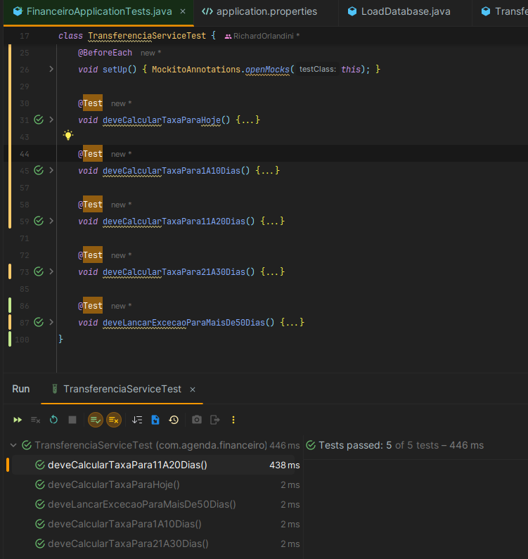

# Sistema de Agendamento de Transferências Financeiras

## Descrição
Este projeto é uma aplicação que permite o agendamento de transferências financeiras com base em regras específicas de cálculo de taxas.

---

## Arquitetura
- **Backend:** Spring Boot 2.7 (Java 11).
- **Frontend:** Vue.js 3.
- **Banco de Dados:** H2 (em memória).

---

## Requisitos do Sistema
- **Java 11** ou superior.
- **Maven** para build do backend.
- **Node.js** (para rodar o frontend).

---

## Endpoints da API

1. **Agendar Transferência:**
    - **Método:** `POST`
    - **URL:** `/api/transferencias`
    - **Body Exemplo:**
      ```json
      {
        "contaOrigem": "1234567890",
        "contaDestino": "0987654321",
        "valor": 1000.0,
        "dataTransferencia": "2023-12-10",
        "dataAgendamento": "2023-12-01"
      }
      ```

2. **Listar Transferências:**
    - **Método:** `GET`
    - **URL:** `/api/transferencias`

---

## Como Subir o Projeto

### {Backend - Spring Boot}
1. Certifique-se de que você tem o **Java 11** e o **Maven** instalados.
2. Navegue até o diretório do backend:
3. Compile e inicie a aplicação:
4. O backend estará acessível em `http://localhost:8081`.

---

### {Frontend - Vue.js}
1. Certifique-se de que você tem o **Node.js** instalado.
2. Navegue até o diretório do frontend:
3. Instale as dependências: ```npm install ```
4. Inicie o servidor de desenvolvimento: ```npm run serve ```
5. O frontend estará acessível em `http://localhost:8080`.

---

## {Banco de Dados H2}
1. O banco de dados H2 está configurado como **em memória**.
2. Para acessar o console do H2:
- URL: `http://localhost:8081/h2-console`
- **JDBC URL:** `jdbc:h2:mem:testdb`
- **Username:** `sa`
- **Password:** (deixe em branco).

3. Execute a seguinte query para visualizar as transferências:
```sql
SELECT * FROM TRANSFERENCIA;
```

## Funcionalidades Implementada
- Agendamento de Transferências:
- Cálculo de taxa baseado no número de dias entre a data de agendamento e a data de transferência.
- Lançamento de exceções para casos inválidos (ex.: data fora do intervalo permitido).
- Listagem de Transferências:
- Exibição de todas as transferências cadastradas.
- Persistência em Banco de Dados:
- Uso do banco H2 em memória.
- 
## Decisões Arquiteturais

### Backend:
- Arquitetura RESTful para a API.
- Validações centralizadas usando @ControllerAdvice.
- Cálculo de taxa implementado no serviço.

### Frontend:
- SPA (Single Page Application) com Vue.js.
- Componentes separados para listagem e agendamento.
- Comunicação com o backend via Axios.

## Estrutura do Projeto

### Backend
```
backend/
├── src/main/java/com/agenda/financeiro/
│   ├── controller/    (Controladores REST)
│   ├── domain/        (Entidades JPA)
│   ├── repository/    (Repositórios JPA)
│   ├── service/       (Regras de Negócio)
│   ├── config/        (Configurações, ex.: CORS)
├── src/main/resources/
│   ├── application.properties (Configuração do H2 e CORS)
```

### Frontend
```
frontend/
├── src/
│   ├── components/       (Componentes Vue.js)
│   ├── router/           (Definição de Rotas)
│   ├── App.vue           (Componente Principal)
│   ├── main.js           (Configuração do Vue.js)
│   ├── vue.config.js     (Configurações do Webpack)
```

---

## Testando a Aplicação
1. Acesse o frontend em [http://localhost:8080](http://localhost:8080).
2. Teste os seguintes fluxos:

   - **Agendar uma Transferência:**
     - Preencha o formulário com os dados necessários.
     - Clique em **Agendar**.

   - **Visualizar Transferências:**
     - Verifique se a transferência aparece na listagem.

   - **Casos Inválidos:**
     - Insira uma data fora do intervalo permitido e veja a mensagem de erro exibida.

---

## Tecnologias Utilizadas

### Backend:
- Spring Boot
- H2 Database
- Maven

### Frontend:
- Vue.js 3
- Axios

---

## Autor
Projeto desenvolvido como parte de um desafio técnico.

## Testes

### Testes Unitários
Os testes unitários foram implementados para validar a regra de negócio principal do sistema, que é o cálculo de taxas baseado no intervalo de dias entre a data de agendamento e a data de transferência. Utilizamos a biblioteca **JUnit 5** e **Mockito** para garantir que as funções da classe `TransferenciaService` estão funcionando corretamente.

### Cobertura dos Testes
- **Cálculo de Taxas:** Testamos todas as faixas de dias descritas na regra de negócio, incluindo:
    - Taxas para transferências agendadas para hoje.
    - Taxas para intervalos de 1 a 10 dias, 11 a 20 dias, 21 a 30 dias, etc.
- **Exceções:** Verificamos se o sistema lança a exceção correta para transferências fora do intervalo permitido (>50 dias).

### Como Executar os Testes
Para executar os testes, use o seguinte comando no terminal:

```bash
mvn test
```

Os resultados dos testes serão exibidos no console, garantindo que todas as funcionalidades estão funcionando conforme esperado.



